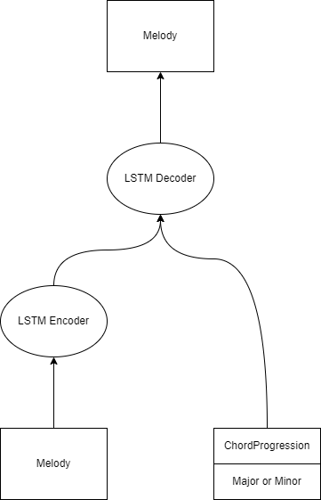

# Benzaiten

Here the chord2melody model is implemented in pytorch.

## Generated Melody

### Onehot Model

<audio controls src="data/sample_wav/onehot.mov"></audio>

### Embedding Chord Model

<audio controls src="data/sample_wav/embedded.mov"></audio>

## Model Overview

### input data

[Charlie Parker's Omnibook MusicXML data](https://homepages.loria.fr/evincent/omnibook/)

### model

